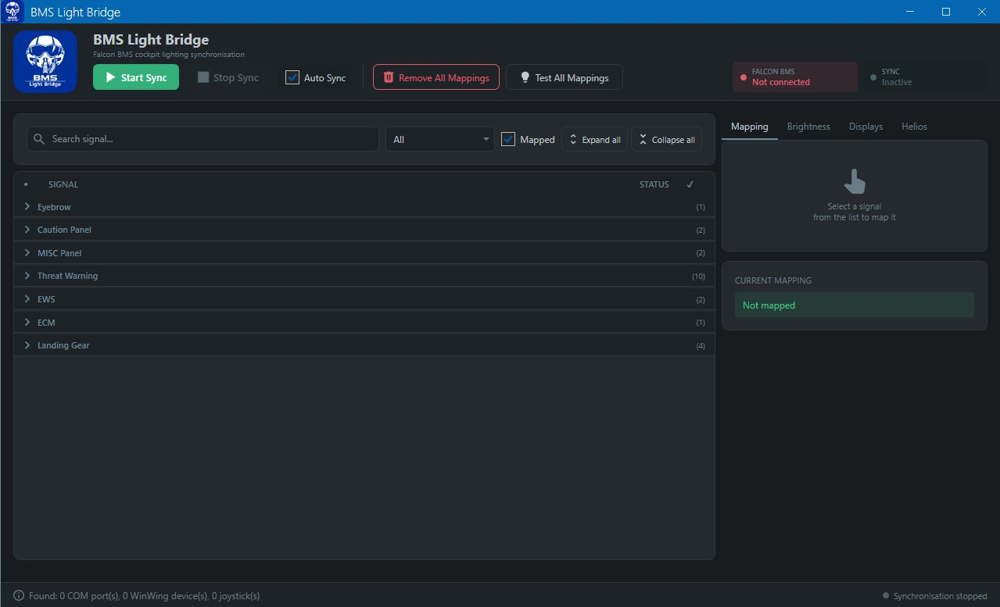

# BmsLightBridge



A C# WPF application that synchronises [Falcon BMS](https://www.benchmarksims.org/) cockpit lighting, display data, and hardware state directly to physical controllers — without relying on middleware like SimAppPro.

## Features

### Signal Mapping
- Maps any BMS cockpit lamp signal (LightBits, LightBits2, LightBits3) to a physical output on a WinWing controller or Arduino board
- Each signal can be mapped to multiple outputs simultaneously
- Duplicate-output detection: warns before overwriting an existing mapping, with an option to move it
- Signals are grouped by category and searchable by name
- **Test Signal** — fires a single mapping without starting full sync, to verify wiring
- **Test All Mappings** — turns all mapped lights on at once for a complete hardware check
- **Arduino Diagnostic** — sends setup and on/off frames to one pin and logs the result

### COM Port & Device Identification
- COM port dropdown shows the device name next to the port number (e.g. `COM5 — F16 Misc G3`)
- Names are resolved in order: DirectInput joystick name → Windows registry FriendlyName → WMI device descriptor
- Boards that expose both a serial port and a HID joystick interface (Teensy, custom F-16 panels) show their joystick name automatically
- Mapping list shows the device name alongside the pin number, matching the style of WinWing mappings
- **Automatic COM port recovery** — if a driver update or USB re-enumeration changes a board's COM port number, BmsLightBridge detects the board by its USB hardware identifier (VID, PID, serial number) and updates all affected mappings silently on startup

### Brightness Control
- Per-channel brightness sliders for every supported WinWing device
- Three binding modes per channel:
  - **Manual** — fixed brightness set by slider
  - **Axis** — maps a joystick axis linearly to brightness (0–255); supports invert
  - **Buttons** — two controller buttons step brightness up/down with velocity-sensitive step size (fast presses = larger steps)
- Live brightness preview updates the slider as you move the physical control
- Auto-detect for axis and button assignment
- Save and Reset buttons per device; settings survive disconnect/reconnect

### Axis to Key
- Maps a joystick axis movement to keyboard key presses, without opening a second DirectInput device
- Configurable sensitivity (1–10), repeat delay, dead zone, and invert
- Supports modifier keys (Ctrl, Shift, Alt) per direction
- Auto-detect for axis and key assignment
- Keys are injected using DIK scancodes via `keybd_event`, compatible with Falcon BMS key bindings including F13–F22

### DED LCD Synchronisation
- Renders the Falcon BMS Data Entry Display (DED) onto the WinWing ViperAce ICP dot-matrix LCD in real time
- No SimAppPro required; communicates directly via HID
- Can be toggled independently from the main sync

### Helios Integration
- Automatically launches Helios Control Center with a selected profile when sync starts
- Optionally closes Helios when sync stops
- Does not launch Helios if it is already running

### General
- **Auto Sync** — automatically starts sync when BMS connects and stops when BMS disconnects
- **Auto Start on Launch** — starts sync immediately when BmsLightBridge opens
- **Start Minimised** — launches to the system tray area
- **Config import / export** — save and load full configurations as JSON files
- Configurable BMS polling interval (default 50 ms)
- Per-Arduino board settings: baud rate, reset delay, DTR enable (supports Leonardo and ESP32)
- Configuration is saved atomically to prevent corruption on crash

## Supported Hardware

| Hardware | PID | Capabilities |
|---|---|---|
| WinWing ViperAce ICP | `0xBF06` | DED LCD sync, brightness, light mapping |
| WinWing CarrierAce PTO 2 | `0xBF05` | Light mapping, brightness |
| WinWing Orion Throttle Base II + F16 Grip | `0xBE68` | Light mapping, brightness |
| WinWing CarrierAce UFC + HUD | `0xBEDE` | Brightness (UFC, LCD & HUD backlight) |
| WinWing CarrierAce MFD C | `0xBEE0` | Brightness |
| WinWing CarrierAce MFD L | `0xBEE1` | Brightness |
| WinWing CarrierAce MFD R | `0xBEE2` | Brightness |
| Arduino / ESP32 (via F4TS) | — | Light mapping |

> All devices above have been actively tested. Any WinWing device that exposes HID light channels can potentially be added.

## Requirements

- [Falcon BMS](https://www.benchmarksims.org/) (tested with BMS 4.38.x)
- Windows 10/11 (64-bit)
- .NET 8.0 runtime (included when published as self-contained)
- WinWing ViperAce ICP (VID `0x4098` / PID `0xBF06`) for DED sync

## Building

1. Clone the repository:
   ```bash
   git clone https://github.com/RedMeKool/BmsLightBridge.git
   cd BmsLightBridge
   ```

2. Open the project in Visual Studio 2022 or later, or build from the command line:
   ```bash
   dotnet publish -c Release -r win-x64 --self-contained true \
     -p:PublishSingleFile=true \
     -p:IncludeNativeLibrariesForSelfExtract=true
   ```

3. The self-contained executable is placed in `bin/Release/net8.0-windows/win-x64/publish/`.

## Usage

1. Launch BmsLightBridge. Start Falcon BMS — the connection indicator turns green automatically.
2. **Mapping tab** — select a signal from the list, choose a device and output, and click **Add Mapping**. Repeat for each light you want to control.
3. **Brightness tab** — select your WinWing controller and set brightness for each channel. Assign a joystick axis or buttons if you have a physical dimmer.
4. **Axis to Key tab** — add bindings to translate axis movement into BMS key presses (e.g. cockpit lighting rotaries).
5. **Displays tab** — enable DED LCD synchronisation if you have a ViperAce ICP.
6. **Helios tab** — configure automatic Helios launch if you use a Helios profile alongside BMS.
7. Press **Start Sync**. All configured outputs will be driven in real time.

> Close BmsLightBridge before uploading a new sketch to an Arduino, or the COM port will be held open.

## Arduino Setup

BmsLightBridge uses the [F4ToSerial (F4TS)](https://github.com/jdahlblom/AirframeSimulatorsHardware) wire protocol. Upload a compatible sketch to your Arduino, then configure the COM port and pin assignments in the Mapping tab.

Supported boards:
- **Arduino Leonardo** — set Reset Delay to `2000 ms`, DTR Enable `on`
- **Arduino Uno** — set Reset Delay to `500 ms`, DTR Enable `on`
- **ESP32** — set Reset Delay to `0 ms`, DTR Enable `off`

Usable digital pins: D2–D13 and A0–A5 (referenced as 14–19). Avoid D0 and D1 (serial RX/TX).

> If a driver update changes your Arduino's COM port number, BmsLightBridge will find it automatically on next startup using the board's USB serial number. No remapping needed.

## Project Structure

```
BmsLightBridge/
├── Services/
│   ├── Icp/
│   │   ├── IcpService.cs          # DED LCD orchestrator
│   │   ├── IcpHidDevice.cs        # Direct HID communication
│   │   ├── DedCommand.cs          # HID command types
│   │   └── DedFont.cs             # Glyph rendering (8×13px bitmap font)
│   ├── WinWingService.cs          # WinWing HID light and brightness control
│   ├── ArduinoService.cs          # Arduino F4TS serial protocol
│   ├── BmsReader.cs               # Falcon BMS shared memory reader
│   ├── AxisBindingService.cs      # Joystick axis/button polling and brightness binding
│   ├── AxisToKeyService.cs        # Axis-to-key injection
│   ├── SyncService.cs             # Main sync orchestrator
│   └── UsbSerialPortHelper.cs     # USB device name resolution (registry, WMI, DirectInput)
├── Models/
│   ├── Configuration.cs           # Full app configuration and persistence
│   ├── AxisToKeyBinding.cs        # Axis-to-key binding model
│   └── BmsSharedMemory.cs         # BMS shared memory layout
├── ViewModels/
│   ├── MainViewModel.cs           # Main application ViewModel
│   ├── AxisToKeyTabViewModel.cs   # Axis to Key tab ViewModel
│   ├── AxisToKeyBindingViewModel.cs # Per-binding ViewModel
│   ├── WinWingLightEntry.cs       # WinWing device light/brightness definitions
│   └── BaseViewModel.cs           # INotifyPropertyChanged base + RelayCommand
├── Resources/
│   ├── DedFont.bmp                # Embedded font bitmap (normal)
│   └── DedFontInverted.bmp        # Embedded font bitmap (inverted)
└── Views/
    ├── MainWindow.xaml            # Full application UI
    └── MainWindow.xaml.cs         # Code-behind (window state, import/export)
```

## Technical Notes

- BMS cockpit state is read from `FalconSharedMemoryArea` (LightBits, LightBits2, LightBits3) at configurable intervals
- The BMS process is verified before opening shared memory to avoid oscillation when BMS closes
- WinWing devices are controlled via 14-byte raw HID output reports; a 1-second heartbeat keeps LEDs lit
- Key injection uses `keybd_event` with `KEYEVENTF_SCANCODE` and DirectInput Key (DIK) scancodes — the only method that works reliably inside Falcon BMS. F13–F22 map to DIK scancodes `0x64`–`0x6D`
- The AxisBindingService maintains a single shared DirectInput instance and axis cache; AxisToKeyService reads from this cache to avoid device conflicts
- DED data is read from `FalconSharedMemoryArea2`; ICP communicates via 64-byte HID packets using `CMD_WRITE_DISPLAY_MEM` and `CMD_REFRESH_DISPLAY`
- Font glyphs are 8×13 pixels, rendered from embedded BMP bitmaps; protocol analysis based on the open-source [DedSharp](https://github.com/broosa/DedSharp) project
- COM port device names are resolved via three sources in priority order: DirectInput `InstanceName` (for boards that also expose a HID joystick interface), Windows registry `FriendlyName`, and WMI `Win32_PnPEntity`. The USB VID, PID, and serial number are persisted per board and used to recover the correct COM port after re-enumeration

## Roadmap

- [ ] UFD (Up-Front Display) support
- [ ] WinWing Combat Ready Panel support (pending PID identification)
- [ ] MPO/OVRD lamp (BMS does not export this bit; workaround via DirectInput button monitoring is under consideration)

## License

[MIT](LICENSE) — feel free to use, modify, and distribute.


